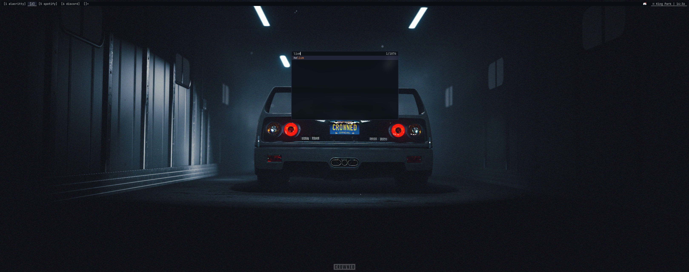
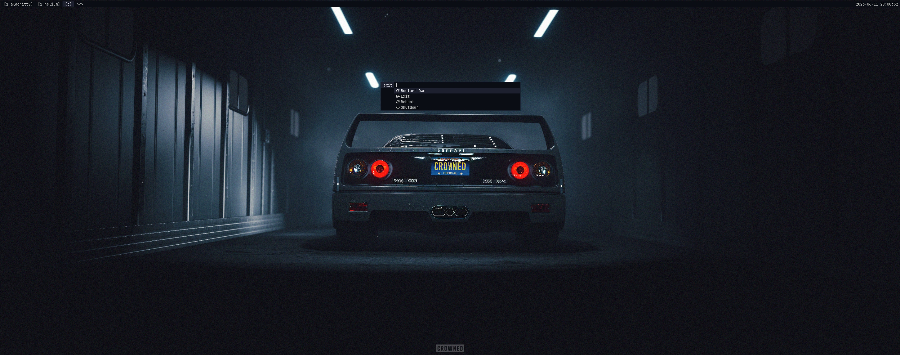
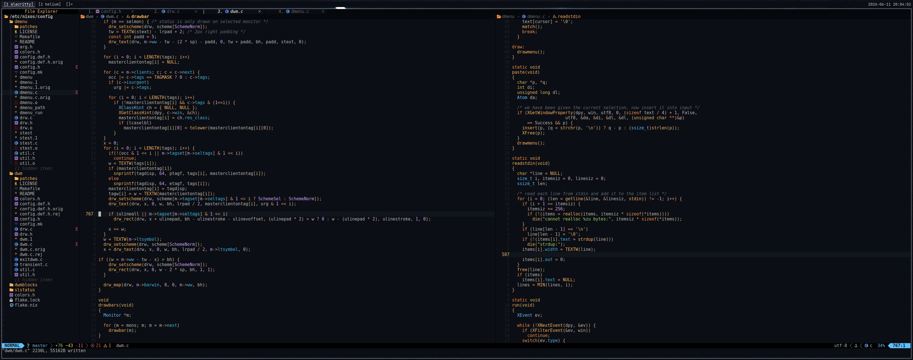

# dotfiles

 

[nixos](https://github.com/terrifictable/dotfiles/tree/nixos)

[home-manager](https://github.com/terrifictable/dotfiles/tree/home-manager)

[wallpapers](https://github.com/terrifictable/dotfiles/tree/wallpapers)
